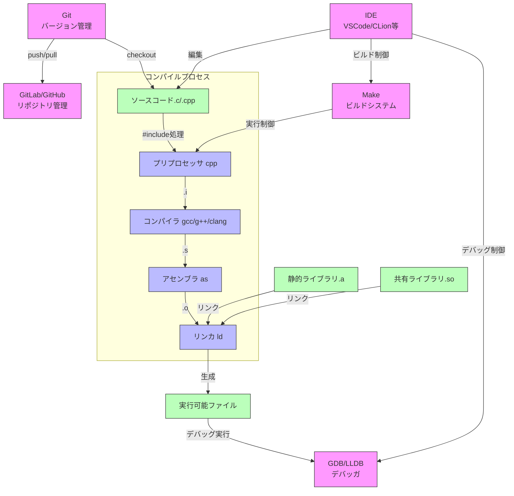

```mermaid
graph TD
    %% バージョン管理関連
    Git[Git<br>バージョン管理]
    GitLab[GitLab/GitHub<br>リポジトリ管理]
    Git -->|push/pull| GitLab
    
    %% ソースコード管理
    Git -->|checkout| A[ソースコード.c/.cpp]
    
    %% ビルドシステム
    Make[Make<br>ビルドシステム]
    Make -->|実行制御| PreProcess
    
    subgraph コンパイルプロセス
        PreProcess[プリプロセッサ cpp]
        Compiler[コンパイラ gcc/g++/clang]
        Assembler[アセンブラ as]
        Linker[リンカ ld]
        
        A -->|#include処理| PreProcess
        PreProcess -->|.i| Compiler
        Compiler -->|.s| Assembler
        Assembler -->|.o| Linker
    end
    
    %% 外部ライブラリ
    StaticLib[静的ライブラリ.a]
    SharedLib[共有ライブラリ.so]
    StaticLib -->|リンク| Linker
    SharedLib -->|リンク| Linker
    
    %% 実行ファイルとデバッグ
    Linker -->|生成| Executable[実行可能ファイル]
    
    %% デバッガ
    GDB[GDB/LLDB<br>デバッガ]
    Executable -->|デバッグ実行| GDB
    
    %% IDE統合
    IDE[IDE<br>VSCode/CLion等]
    IDE -->|編集| A
    IDE -->|ビルド制御| Make
    IDE -->|デバッグ制御| GDB
    
    %% スタイル設定
    classDef tool fill:#f9f,stroke:#333
    classDef file fill:#bfb,stroke:#333
    classDef process fill:#bbf,stroke:#333
    
    class Git,GitLab,Make,GDB,IDE tool
    class A,StaticLib,SharedLib,Executable file
    class PreProcess,Compiler,Assembler,Linker process
```
