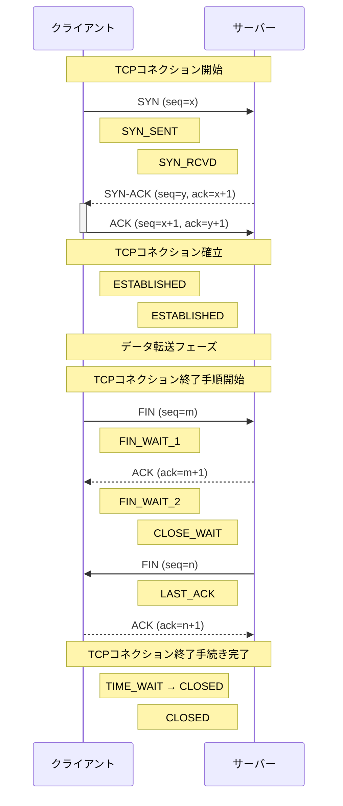

```mermaid
sequenceDiagram
    participant クライアント
    participant サーバー

    %% TCPコネクションの確立 %%
    Note over クライアント,サーバー: TCPコネクション開始
    クライアント->>サーバー: SYN (seq=x)
    Note right of クライアント: SYN_SENT
    Note left of サーバー: SYN_RCVD
    サーバー-->>クライアント: SYN-ACK (seq=y, ack=x+1)
    activate クライアント
    クライアント->>サーバー: ACK (seq=x+1, ack=y+1)
    deactivate クライアント
    Note over クライアント,サーバー: TCPコネクション確立
    Note right of クライアント: ESTABLISHED
    Note left of サーバー: ESTABLISHED

    %% データ転送フェーズ %%
    Note over クライアント,サーバー: データ転送フェーズ

    %% TCPコネクションの終了 %%
    Note over クライアント,サーバー: TCPコネクション終了手順開始
    クライアント->>サーバー: FIN (seq=m)
    Note right of クライアント: FIN_WAIT_1
    サーバー-->>クライアント: ACK (ack=m+1)
    Note right of クライアント: FIN_WAIT_2
    Note left of サーバー: CLOSE_WAIT
    サーバー->>クライアント: FIN (seq=n)
    Note left of サーバー: LAST_ACK
    クライアント-->>サーバー: ACK (ack=n+1)
    Note over クライアント,サーバー: TCPコネクション終了手続き完了
    Note right of クライアント: TIME_WAIT → CLOSED
    Note left of サーバー: CLOSED
```
