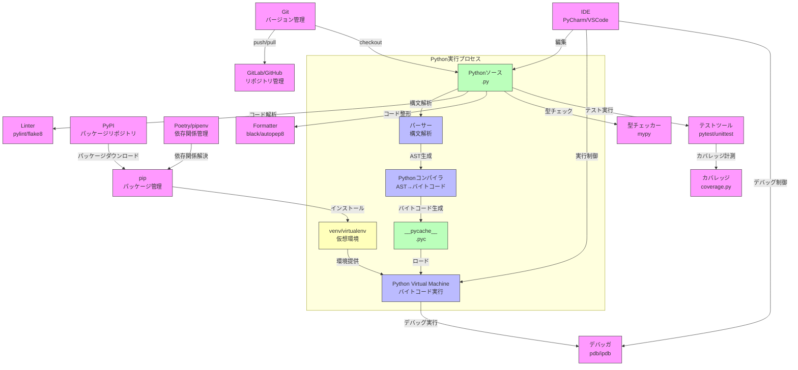

```mermaid
graph TD
    %% バージョン管理関連
    Git[Git<br>バージョン管理]
    GitLab[GitLab/GitHub<br>リポジトリ管理]
    Git -->|push/pull| GitLab
    
    %% ソースコード管理
    Git -->|checkout| SourceCode[Pythonソース<br>.py]
    
    %% パッケージ管理
    PyPI[PyPI<br>パッケージリポジトリ]
    PipTool[pip<br>パッケージ管理]
    Poetry[Poetry/pipenv<br>依存関係管理]
    PyPI -->|パッケージダウンロード| PipTool
    Poetry -->|依存関係解決| PipTool
    PipTool -->|インストール| VEnv
    
    %% 仮想環境
    VEnv[venv/virtualenv<br>仮想環境]
    
    subgraph Python実行プロセス
        Parser[パーサー<br>構文解析]
        Compiler[Pythonコンパイラ<br>AST→バイトコード]
        PyCache[__pycache__<br>.pyc]
        PVM[Python Virtual Machine<br>バイトコード実行]
        
        SourceCode -->|構文解析| Parser
        Parser -->|AST生成| Compiler
        Compiler -->|バイトコード生成| PyCache
        PyCache -->|ロード| PVM
        VEnv -->|環境提供| PVM
    end
    
    %% 開発ツール
    IDE[IDE<br>PyCharm/VSCode]
    IDE -->|編集| SourceCode
    IDE -->|実行制御| PVM
    
    %% コード品質
    Linter[Linter<br>pylint/flake8]
    Formatter[Formatter<br>black/autopep8]
    TypeChecker[型チェッカー<br>mypy]
    
    SourceCode -->|コード解析| Linter
    SourceCode -->|コード整形| Formatter
    SourceCode -->|型チェック| TypeChecker
    
    %% テスト関連
    PyTest[テストツール<br>pytest/unittest]
    Coverage[カバレッジ<br>coverage.py]
    
    SourceCode -->|テスト実行| PyTest
    PyTest -->|カバレッジ計測| Coverage
    
    %% デバッガ
    PDB[デバッガ<br>pdb/ipdb]
    PVM -->|デバッグ実行| PDB
    IDE -->|デバッグ制御| PDB
    
    %% スタイル設定
    classDef tool fill:#f9f,stroke:#333
    classDef file fill:#bfb,stroke:#333
    classDef process fill:#bbf,stroke:#333
    classDef env fill:#ffb,stroke:#333
    
    class Git,GitLab,PyPI,PipTool,Poetry,IDE,Linter,Formatter,TypeChecker,PyTest,Coverage,PDB tool
    class SourceCode,PyCache file
    class Parser,Compiler,PVM process
    class VEnv env
```
